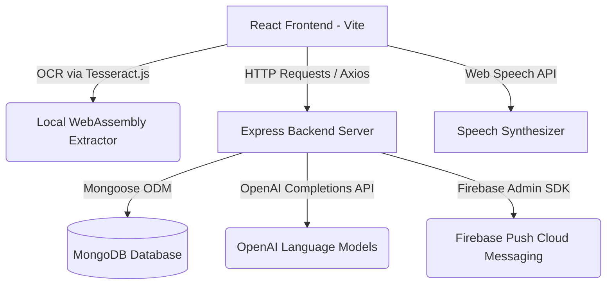

# Product Requirements Document (PRD) - MediCare AI

## 1. Product Overview
**MediCare AI** is an AI-powered Medical Reminder & Elderly Healthcare Assistance Application designed to solve the accessibility, consistency, and comprehension challenges elderly patients face when managing their daily medications. 

By linking elderly patients with their designated caregivers, MediCare AI ensures that seniors remain compliant with their prescriptions while caregivers have real-time visibility into their adherence. The product focuses on visual, voice, and automated intelligence to simplify health tracking.

---

## 2. Target Audience & Personas
* **Elderly Patients**: Often suffer from visual impairment, cognitive delay, motor skill decline, or general unfamiliarity with complex mobile UI. They require large touch controls, high contrast typography, voice feedback, and simplified, non-technical instructions.
* **Caregivers (Family/Professional)**: Need a remote portal to monitor patient compliance, manage medicine lists, and ensure stocks are sufficient.

---

## 3. Product Features & Requirements

### 3.1. Core Reminder & Scheduling System
* **Elderly Checklists**: Generates a daily dashboard showing pending, taken, and missed medications.
* **Smart Scheduling**: Supports daily, weekly, or specific time frequencies. Includes options for before/after food configurations.
* **Pill Stock Tracking**: Tracks current stock. Automatically decrements counts when a dose is taken. Warns users and caregivers when the count falls below the warning threshold.

### 3.2. Voice Assistant & Interactive Controls
* **Global Voice Assistant Toggle**: Users can turn the assistant ON/OFF in Settings. When OFF, all speech recognition overlays are hidden, and Text-to-Speech (TTS) synthesis is silenced.
* **Multilingual Assistance**: Supports voice synthesis read-alouds and speech-to-text recognition in English, Spanish, and Hindi.
* **Voice Command Navigation**: Supports hands-free navigation commands (e.g. *"Show medicines"*, *"Did I take medicine?"*, *"Open chatbot"*).

### 3.3. AI Prescription Analyzer & OCR Scanning
* **OCR Parsing**: Extracts raw text from prescription image uploads (PNG/JPG) using client-side `Tesseract.js` or from PDF doctor reports.
* **AI Summary Engine**: Sends raw text to the backend OpenAI processor to extract medication names, frequencies, dosages, side effects, food restrictions, and drug interactions.
* **Instant Scheduler**: Pre-fills scheduling forms using the parsed results, enabling users to add medications to their calendar with a single click.
* **Speech Output**: Verbally speaks the AI summary using speech synthesis for visually impaired users.

### 3.4. Caregiver Portal
* **Real-time Supervision**: Displays linked patients and their daily compliance rates.
* **Patient Link Management**: Caregivers can link and unlink patients by entering their email address.

### 3.5. Theme System & Visual Style
* **High Contrast Modes**: Strictly provides Light and Dark modes.
  * *Light Mode*: Pure white (`#ffffff`) background, white cards with subtle shadows, and dark gray text.
  * *Dark Mode*: Dark gray or black (`#121212` or `#0f0f0f`) background, lighter dark gray cards, and white/light gray text.
* **Elderly Accessibility**: Minimal and elegant design following Notion/ChatGPT styles. No gaming elements, glowing accents, or mixed color backgrounds.

---

## 4. Technical Architecture

### 4.1. Tech Stack
* **Frontend**: React (Vite), Tailwind CSS, Axios, Lucide Icons, `tesseract.js` (WebAssembly-based client-side OCR).
* **Backend**: Node.js, Express.js.
* **Database**: MongoDB (Mongoose ODM) with mock database backup modules for local offline capability.
* **Cloud & AI APIs**: OpenAI Chat Completions API, Firebase Cloud Messaging (FCM) push notifications.
* **Browser Integration**: Web Speech API (Synthesis & Recognition).

---

## 5. Core Data Schemas

### 5.1. User Model
* `name` (String, Required)
* `email` (String, Required, Unique)
* `password` (String, Required)
* `role` (Enum: `elderly`, `caregiver`)
* `phone` (String)
* `caregiverId` (ObjectId ref User)
* `emergencyContactName` (String)
* `emergencyContactPhone` (String)
* `language` (String, Default: `en`)
* `theme` (String, Default: `light`)
* `voiceAssistantActive` (Boolean, Default: `true`)

### 5.2. Medicine Model
* `userId` (ObjectId ref User, Required)
* `name` (String, Required)
* `dosage` (String)
* `frequency` (String)
* `timings` (Array of Strings)
* `beforeAfterFood` (String)
* `stock` (Number, Default: 30)
* `stockAlertThreshold` (Number, Default: 5)
* `prescriptionFile` (String, Base64 attachment)
* `prescriptionFileName` (String)
* `active` (Boolean, Default: `true`)

### 5.3. MedicalReport Model
* `userId` (ObjectId ref User, Required)
* `fileName` (String, Required)
* `extractedText` (String, Required)
* `aiSummary` (String, Required)
* `extractedMedicines` (Array of objects containing `name`, `dosage`, `frequency`, `timings`)
* `healthInsights` (Object containing `sideEffects` array, `foodPrecautions` array, and `interactions` array)
* `createdAt` (Date, Default: Date.now)

---

## 6. Changelog

### v1.2.0 - May 2026
* **Removal of Emergency SOS Feature**: Removed the emergency SOS trigger APIs, the `EmergencyAlert` collection, the dashboard panic siren button, caregiver dashboards alert resolver components, and voice assistant SOS routing.

### v1.1.0 - May 2026
* **Feat (AI Prescription Analyzer)**: Added client-side `tesseract.js` OCR text extraction for PNG/JPG files and PDF transcription logic. Added `/api/reports/analyze` endpoint utilizing OpenAI Chat completions (with regular expression local fallbacks) to simplify prescription text.
* **Feat (Voice Toggle Settings)**: Implemented global `voiceAssistantActive` setting. Includes toggles on the Settings page, updates profile databases, and overrides all speech engine syntheses/listeners if set to OFF.
* **Fix (Theme Inversion Bug)**: Corrected class bindings where dark mode displayed light backgrounds and vice versa. Revamped UI layout to follow Notion/ChatGPT styles (clean margins, green accents, neutral card shadows).
* **Feat (File Upload Mappings)**: Enabled attaching PDF/Image documents directly to active medicines.
